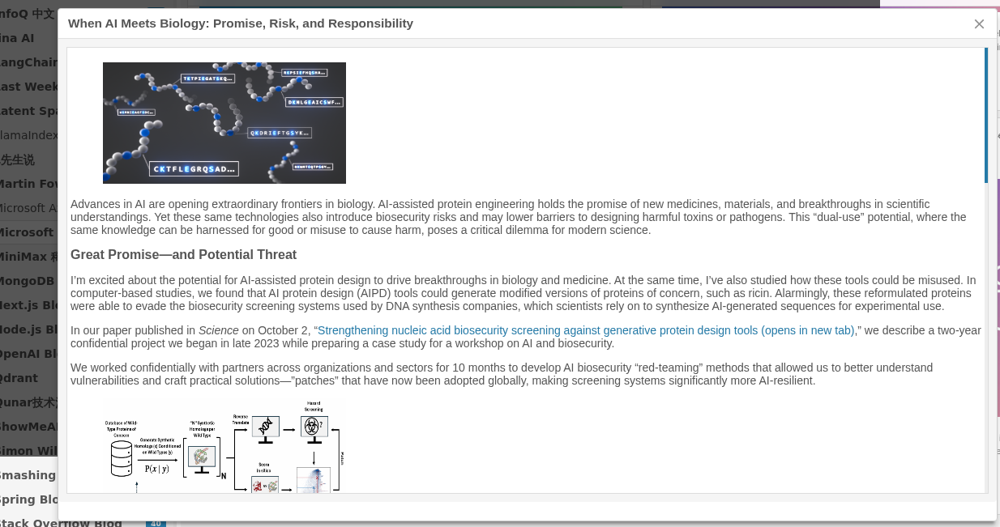
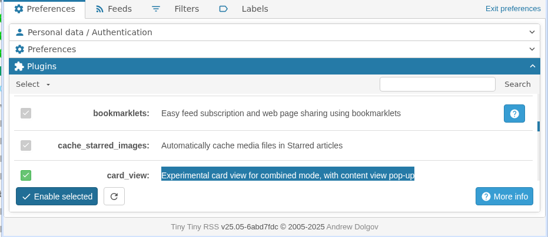

# Introduction

Card view plugin for tt-rss can display rss feed items as cards, with thumbnail image and content preview.

And this forked version allow you to click the card to get a full-text content view (as long as the feed contains full-text).




# Install

1.  Enter your tt-rss installation, go to /var/www/html/tt-rss/plugins.local/ (or occording your case), run following command:

```
git clone https://github.com/vector090/tt-rss-plugin-card-view card_view
```

2. Go to tt-rss Preferences - Plugins, find 'card\_view', have it checked, then 'Enable selected'.


3. Refresh tt-rss main page, then enjoy!
